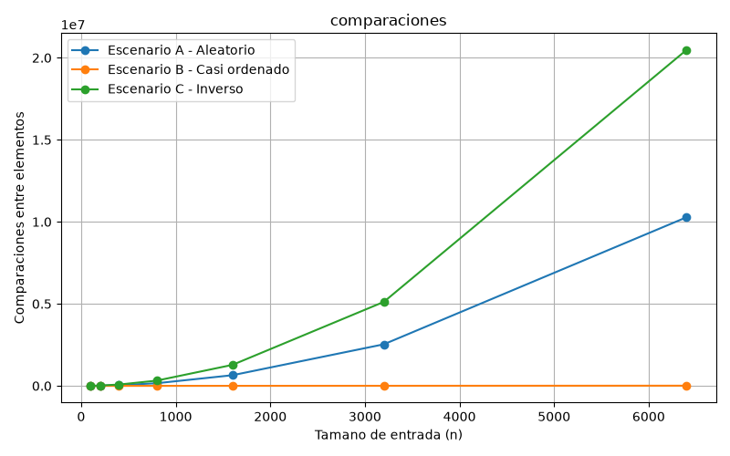
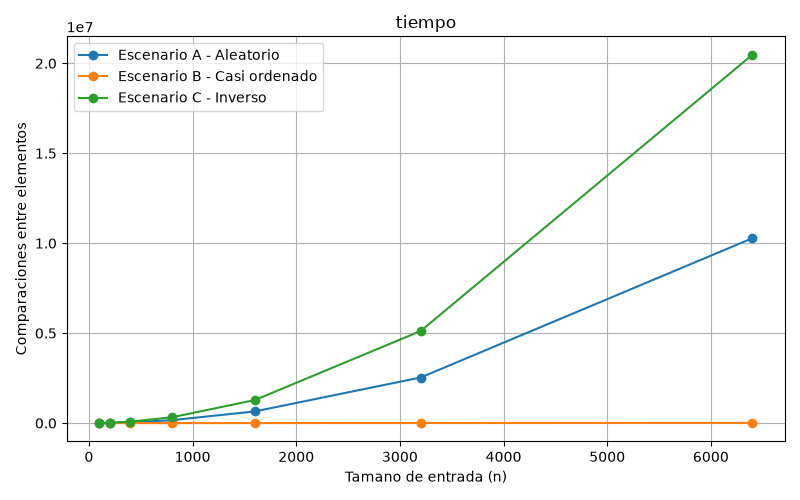
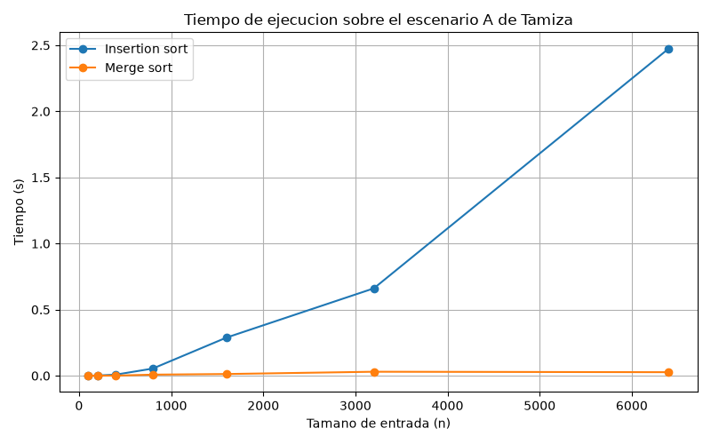

# Laboratorio 1 — Fundamentos, complejidad y recurrencias

**Autor:** Alvaro Sotelo — Análisis de Algoritmos, ITM.

## Instrucciones de reproducción

1. Activar el entorno virtual desde la raíz del repositorio: `venv\Scripts\activate`.
2. Desde la carpeta `laboratorios/lab1-fundamentos-complejidad-recurrencias/` ejecutar:
   - `python parte3_casos.py` — genera las gráficas `parte3_comparaciones.png` y `parte3_tiempo.png` en `graficas/`.
   - `python parte4_complejidad.py` — genera la gráfica `parte4_tiempo.png` en `graficas/`.

---

## Parte 1 — Analizar el algoritmo antes de comprar hardware

1. El algoritmo funciona desde hace 8 años y entrega el resultado correcto, pero el problema dice que ya desbordó la ventana 3 veces, antes de comprar un servidor o recursos fisicos para el actual conviene analizar que condiciones han cambiado para que antes si se cumplía la ventana de tiempo y ahora no, si hay mas cantidad de datos para procesar es una razón por la cual pensar que debe revisarse entre las primeras razones el algoritmo de procesamiento, esto podria indicar que con el algoritmo actual no es seguro cumplir con el requerimiento de tiempo de ventana no negociable de 4 horas, entre las 2:00 y las 6:00 a.m. debido a la complejidad de resolución y el problema puede aumentar en vez de disminuir con el tiempo y la cantidad de datos.

2. Si duplicas la velocidad del servidor, el algoritmo sigue haciendo la misma cantidad de comparaciones, el orden de crecimiento no cambia y el problema puede haberse solucionado ilusoriamente y por un tiempo que podría ser muy poco para ser una solución, por ejemplo: 60× más datos significaria 3600× más comparaciones (comportamiento cuadrático), y el ×2 de velocidad es solo una constante.

3. Ejemplo de un excel que carga mas de 10 mil de filas muchas de ellas con sus respectivas formulas donde cada una tarda segundos en calcular, este puede afectar y colocar la maquina en estado de 'Muerta' por un tiempo considerable y puede parar el trabajo de quienes hacen este proceso, además esto puede ser bastante critico en un archivo de trabajo colaborativo en linea. El algoritmo da el resultado correcto, se demora y funciona pero es inviable con el tiempo, la obsolecencia de los equipos y el crecimiento de la cantidad de datos y registros por agregar.

---

## Parte 2 — Responsabilidad ambiental y ética

Dimensión ambiental: al tener un algoritmo ineficiente de trabajar durante la ventana de 4 horas, se deben realizar todas las noches durante años y cada minuto de cpu extra cada noche incurre en un mayor procesamiento, todo esto lleva a un consumo mayor de energía eléctrica lo cual afecta directamente el uso de los recursos no renovables, por lo que podemos ver que este efecto se multiplica.

Dimensión ética: Puede haber pacientes de alto riesgo que deban ser atentidos con prioridad y el pagaría el costo de no tener esa atención a tiempo lo cual podría complicar sus condiciones de vida parcial o definitivamente.

El funcionario o trabajador que debe procesar a los pacientes, podría tener inconvenientes con ellos y sus familiares al no ser atendidos con la prioridad del caso, esto puede conllevar a inconvenientes en su jornada de trabajo, problemas fuertes con las demas personas, presión laboral y estrés y la institución podría recibir reclamos de muchos casos y hasta el caso podría escalar a pagar indemnizaciones en otros.

Con una cantidad de datos tan grande el orden de la lista es vital, ya que en poco tiempo no se alcanzan a atender todos los pacientes y la lista decide quienes van primero por prioridad en atencion, con un mal orden en la lista la atención medica el servicio de la entidad se va degradando, la calidad de vida de sus pacientes y la imagen de la entidad.

---

## Parte 3 — Peor caso, mejor caso y caso promedio

### 3.1 — Explicación

Peor caso: es el caso que con el cual el algoritmo tomaría la mayor cantidad de tiempo en ser resuelto, para el caso seria recibir la entrada en el orden inverso en todas las entradas de tamaño n.

Mejor caso: es el caso con el cual el algoritmo toma el menor tiempo posible, para el caso es recibir la entrada de tamaño n ya en orden.

Caso promedio: es el caso complementario a los dos anteriores en el cual el algoritmo toma un tiempo considerable entre el mejor y el peor caso para la entrada de tamaño n, podría hallarse una media aritmética entre la cantidad posible de entradas para hallar su promedio de tiempo o procesamiento.

Para entrar a producción es mejor tener en cuenta el peor caso, la decisión esta basada en que la ventana de mantenimiento es estricta.

Predicción antes de medir: Para insertion sort espero que el peor caso corresponda al escenario C que corresponde al orden inverso, ya que hay que ordenar de mayor a menor, la entrada invertida obliga a que cada nuevo elemento recorra toda la parte ya ordenada, haciendo el máximo de comparaciones.

El mejor caso debería ser el escenario B que corresponde a casi ordenado, casi todos los elementos ya están en su posición, así que cada uno se compara pocas veces antes de detenerse.

El escenario A corresponde a un caso aleatorio debería quedar en un punto intermedio, representando el caso promedio.

### 3.2 — Demostración experimental

Código del experimento: [parte3_casos.py](parte3_casos.py), [algoritmos.py](algoritmos.py) y [datos.py](datos.py).





Escenario C se desbordo en comparaciones con n=6400, 20.476.800, n²/2 resultó el peor caso.

Escenario B 10649 comparaciones podemos ver que es casi lineal y corresponde con el mejor caso.

Escenario A intermedio corresponde a un comportamiento n²/4 y corresponde al caso promedio.

Las predicciones fueron acordes y se cumplieron.

---

## Parte 4 — Complejidad de merge sort e insertion sort

### 4.1 — Cálculo teórico

#### 4.1.a — Planteamiento de la recurrencia

Merge sort divide el problema en 2 subproblemas de tamaño n/2 y el costo de combinar es la mezcla de las dos mitades, esto es lineal en n. Por eso: T(n) = 2*T(n/2) + Θ(n) con T(1) = Θ(1).

Descripcion de cada término: 2 = dos llamadas recursivas; n/2 = cada llamada trabaja sobre la mitad; Θ(n) = recorrido de la mezcla; Θ(1) = caso base.

#### 4.1.b — Resolución de la recurrencia por sustitución

La recurrencia de merge sort es T(n) = 2T(n/2) + Θ(n). El término Θ(n) lo escribo con una constante, por lo tanto: T(n) = 2T(n/2) + cn.

La hipótesis es que la solución es O(n*log n): T(n/2) ≤ C*(n/2)*log(n/2), con C > 0.

Sustitución:

```
T(n) ≤ 2*[C*(n/2)*log(n/2)] + cn
     = C*n*log(n/2) + cn
     = C*n*(log n − log 2) + cn
     = C*n*log n − C*n + cn
```

Se usa la propiedad log₂(n/2) = log₂ n − log₂ 2, con log₂ 2 = 1. Para que el resultado sea ≤ C*n*log n, el término sobrante −C*n + cn debe ser ≤ 0, es decir C ≥ c. Se elige C ≥ c y queda:

```
T(n) ≤ C*n*log n   ⇒   T(n) = O(n*log n)
```

Caso base: en n = 1 la cota falla porque log 1 = 0; se toma la base en n₀ = 2, eligiendo C suficientemente grande para que T(2) = 2T(1) + 2c ≤ C*2*log 2 = 2C.

Cota inferior: repitiendo el argumento con C' ≤ c se obtiene T(n) ≥ C'*n*log n, es decir T(n) = Ω(n*log n).

Conclusión: como T(n) = O(n*log n) y T(n) = Ω(n*log n), el orden exacto es Θ(n*log n).

#### 4.1.c — Insertion sort línea a línea

Analizo mi implementación sobre su bucle central. Las líneas de instrumentación (datos.copy(), el contador de comparaciones) agregan un costo constante Θ(1) que no altera el orden de crecimiento.

| Línea | Número de ejecuciones |
|---|---|
| Ciclo for j = 2 … n | n |
| clave = A[j], i = j−1 | n−1 (cada una) |
| while que compara elementos | Σⱼ tⱼ |
| desplazamiento A[i+1] = A[i] | Σⱼ (tⱼ − 1) |
| inserción A[i+1] = clave | n−1 |

- Mejor caso (entrada ya en el orden pedido): cada tⱼ = 1, Σtⱼ = n−1 → Θ(n).
- Peor caso (entrada invertida): cada tⱼ = j, Σtⱼ = n(n−1)/2 → Θ(n²).
- Caso promedio: en promedio cada elemento se desplaza la mitad de la parte ordenada → Θ(n²).

#### 4.1.d — Tabla de complejidades

| Algoritmo | Mejor | Promedio | Peor |
|---|---|---|---|
| Insertion | Θ(n) | Θ(n²) | Θ(n²) |
| Merge | Θ(n*log n) | Θ(n*log n) | Θ(n*log n) |

### 4.2 — Validación experimental

Código del experimento: [parte4_complejidad.py](parte4_complejidad.py).



La curva de insertion sort crece desmedidamente a medida que n crece se puede ver que es en forma cuadrática, la de merge sort se ve que casi no sube, es decir si crece pero suavemente, por ejemplo n=6400 tenemos insertion sort con 2,47S y merge con 0,027S. Por lo anterior es recomendable merge para TAMIZA porque su tiempo de procesamiento crece mucho mas lento. Esta conclusión coincide con las complejidades calculadas en 4.1: merge Θ(n*log n) vs insertion Θ(n²).

### 4.3 — Concepto técnico a la Secretaría de Salud

Mi recomendación es implementar merge sort, la misma implementación para todos los canales de entrada, para los 3 canales de entrada los tiempos son muy idénticos ya que tenemos estas comparaciones A=8.735, B=4.957, C=5.044 en n=1.000

Estimación del tiempo de un calculo especifico:

insertion sort: n=6400 t=2,47 s

merge sort: n = 6400 t = 0,027 s

Para un objetivo de n = 1200000 tenemos un crecimiento de 1200000 / 6400 = 187.5 veces,

Para insertion sort que es Θ(n²) si n se multiplica por k, el costo se multiplica por k² y k² = 187,5² = 35.156.

tiempo: 2,47 s × 35.156 = 86.835 s = 24 horas

Duplicar la velocidad del servidor solo divide eso a la mitad: ≈12 horas, sigue sin caber en 4.

Para merge sort que es Θ(n*log n) el costo se multiplica por k,

log₂(6.400)= 12,64

log₂(1.200.000)=20,19

20,19 / 12,64 = 1,6 veces de crecimiento

187,5 × 1,6 = 300

tiempo = 0,027 s × 300 = 8,1 s

Aqui podemos seguir bajo las mismas condiciones del servidor.

Nota: Este proceso es una estimacion aproximada no un calculo exacto, ya que se parte de varios supuestos como que el procesamiento siga bajo las mismas condiciones como el mismo servidor, el mismo software, la misma carga operativa entre otros.

Extrapolando por la forma de la curva desde n=6400 para insertion sort el tiempo se multiplica por 35000 esto nos lleva a 24 horas dividiendo este ultimo a la mitad con el nuevo servidor serian 12 horas, ni el servidor del doble de velocidad alcanza, para merge sort se multiplica por 300 esto nos lleva a 8 segundos.

Esto anterior es una estimación basada en la complejidad de cada caso.