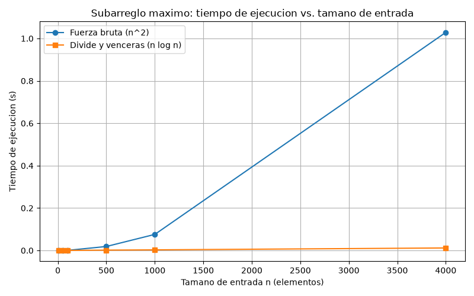

# Laboratorio 2 — Dividir y vencer: subarreglo máximo

Autor: Alvaro Sotelo — Análisis de Algoritmos, ITM.

## Instrucciones de reproducción

1. Activar el entorno virtual desde la raíz del repositorio con el comando venv\Scripts\activate.

2. Desde esta carpeta (laboratorios/lab2-divide-y-vencer/), ejecutar:
   - python pruebas.py, que verifica ambas soluciones.
   - python medicion.py, que mide, verifica que las sumas coincidan y genera la gráfica.

---

## Parte 1 — Implementar y verificar las dos soluciones

Código: [subarreglo.py](subarreglo.py) · [pruebas.py](pruebas.py)

La solución por fuerza bruta recorre todos los pares de días (i, j) y acumula la suma dentro del
ciclo para no recalcularla, lo que da Θ(n²). La solución por divide y vencerás parte el arreglo por
la mitad y resuelve tres casos: el tramo está en la mitad izquierda, en la derecha, o cruza el punto
medio. El caso cruzado se resuelve con un barrido lineal desde el centro hacia cada lado, guardando
el mejor tramo de cada mitad y sumándolos.

En pruebas.py verifiqué con assert que ambas soluciones devuelven la misma suma en: la serie de ocho
días (suma 17), un solo elemento, todos los valores negativos, todos los valores positivos, un tramo
que cruza el punto medio, veinte listas aleatorias con semilla fija y una comprobación de que
ninguna función modifica la lista recibida.

## Parte 2 — Medir y graficar

Código: [medicion.py](medicion.py)

En medicion.py generé las series con semilla fija (random.Random(2026)) de enteros entre -100 y 100,
y usé la misma lista para ambos algoritmos en cada tamaño. Cronometré únicamente la llamada al
algoritmo con time.perf_counter(), repetí cada medición tres veces y grafiqué la mediana para reducir
el ruido del sistema operativo. Dentro del propio experimento verifiqué que ambas soluciones
coinciden en la suma para cada tamaño. Los tamaños medidos fueron 10, 50, 100, 500, 1000 y 4000.

## Parte 3 — Análisis

### 1. Recurrencia

Mi subarreglo_maximo parte la serie en dos mitades y resuelve cada una recursivamente, por eso
aparecen 2 subproblemas de tamaño n/2. Como el mejor tramo puede cruzar el punto medio, en cada
llamada hago un barrido lineal desde el centro hacia cada lado para resolver ese caso cruzado, y ese
barrido cuesta Θ(n). El caso base es un solo elemento, T(1) = Θ(1). Entonces:

T(n) = 2·T(n/2) + Θ(n)

Con el método maestro: a = 2, b = 2, f(n) = Θ(n). Calculo n^(log_b a) = n^(log_2 2) = n. Como
f(n) = Θ(n) tiene el mismo orden que n, se cumple el caso 2, y la solución es Θ(n log n).

La fuerza bruta prueba todos los pares (i, j) con i ≤ j, que son del orden de n²/2, y en cada par
solo suma el elemento nuevo (acumula), así que cada par cuesta O(1). Por eso su complejidad es Θ(n²).

### 2. Lo medido contra lo esperado

En la gráfica, la curva de la fuerza bruta sube mucho más rápido que la de divide y vencerás.
Tomando dos tamaños consecutivos donde n se duplica, de 500 a 1000: el tiempo de la fuerza bruta se
multiplicó por = 4.04, que es prácticamente 4 = 2², lo que coincide con Θ(n²). El de divide y vencerás
se multiplicó por = 1.76, del orden de 2, que es lo que predice Θ(n log n) al duplicar n (queda algo
por debajo del valor teórico = 2.2 por el ruido de las mediciones). Si miro de 1000 a 4000, la fuerza
bruta crece = 13.6 (cerca de 4² = 16) y divide y vencerás = 4.11, otra vez muy por debajo.

### 3. Tamaños pequeños

Sí hay un tamaño a partir del cual divide y vencerás gana: en n = 10 y n = 50 la fuerza bruta fue
más rápida, y a partir de n = 100 divide y vencerás se impone. Esto ocurre porque a tamaños pequeños
pesan las constantes ocultas: la recursión hace muchas llamadas, cada una reserva un marco en la
pila, y el barrido cruzado recorre la serie aunque sea corta. Esas constantes pesan más que la
ventaja asintótica hasta que n crece lo suficiente.

### 4. ¿Cuándo conviene dividir?

Para hallar el máximo de un arreglo, dividirlo a la mitad da T(n) = 2·T(n/2) + Θ(1), porque combinar
es solo comparar los dos máximos parciales, una operación constante. Con el método maestro,
n^(log_2 2) = n y f(n) = Θ(1) es menor, así que es el caso 1 y T(n) = Θ(n). La alternativa directa,
recorrer el arreglo una vez llevando el máximo, también es Θ(n).

Es decir, dividir da la misma complejidad en tiempo, pero cuesta más: cada llamada recursiva reserva
un marco en la pila, mientras que el recorrido directo solo mantiene una variable. En términos de
memoria, la recursión usa O(log n) marcos frente a O(1) del recorrido directo, así que la recursión
también gasta más memoria RAM. Por eso, cuando dos soluciones son aproximadamente iguales en
procesamiento, conviene la versión directa (o la de fuerza bruta): hace las mismas cuentas con menos
llamadas, menos sobrecarga y menos memoria. Aun así, la decisión también debe mirar la escalabilidad a
mediano y largo plazo, para garantizar la mejor operación y no tener que migrar el código más
adelante.

### 5. Concepto para la gerente

Le recomiendo usar divide y vencerás para encontrar la mejor racha. Tomando como base mi medición en
n = 4000, donde la fuerza bruta tardó 1.03 s y divide y vencerás 0.0118 s, para 1.000.000 de registros
el factor de crecimiento es k = 1.000.000 / 4000 = 250. Como la fuerza bruta es Θ(n²), el tiempo se
multiplicaría por k² = 62500, dando cerca de 64.284 s (unas 17.9 horas). Divide y vencerás es
Θ(n log n), así que el factor es k·(log₂ 1.000.000 / log₂ 4000) = 250·1.665 = 416, y el tiempo
quedaría alrededor de 4.9 s. Aclaro que es una estimación, no una medición: supone que el equipo y
las condiciones se mantienen iguales. Con esos números, la diferencia es enorme para el volumen que
planean analizar.
